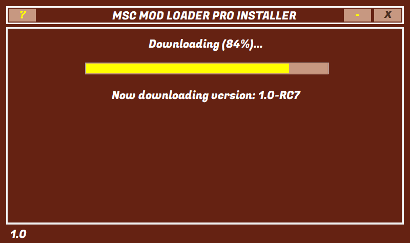
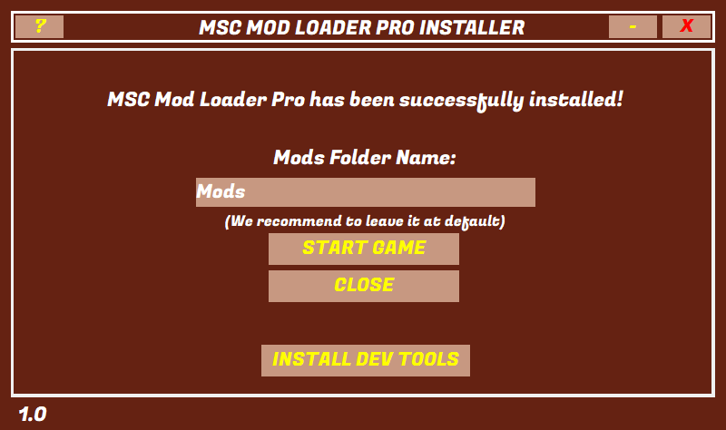

# Download

You can download Mod Loader Pro Installer from the link below:

<a href="//github.com/MSCLoaderPro/docs/releases/latest/download/Installer.exe" target="_blank"><button class="btn-download">Download</button></a>

Alternatively, you can <a href="//github.com/MSCLoaderPro/MSCModLoaderPro/releases/latest">install Mod Loader Pro manually</a>.

## Installing Mod Loader Pro

After you download the **Installer**, start it by double-clicking the icon. You'll see a screen below:

Installer should locate your MSC installation automagically. If not, you can point it to MSC folder of your chosing.

Click "Install" in order to continue. It will take a short while for Installer to download and install the Mod Loader Pro.

After it's done, you can select where your Mods are being installed.

!> Although while you can change the Mods folder name and location, it is not recommended to do!

